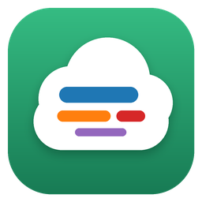
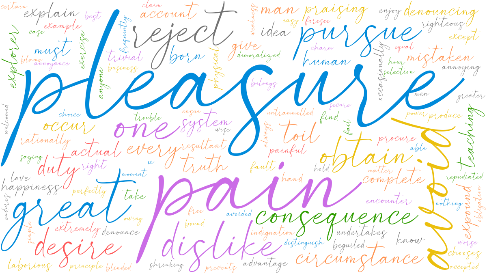
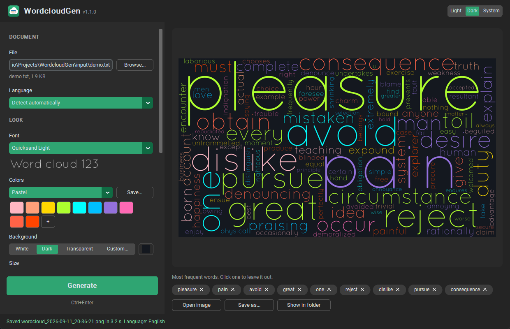
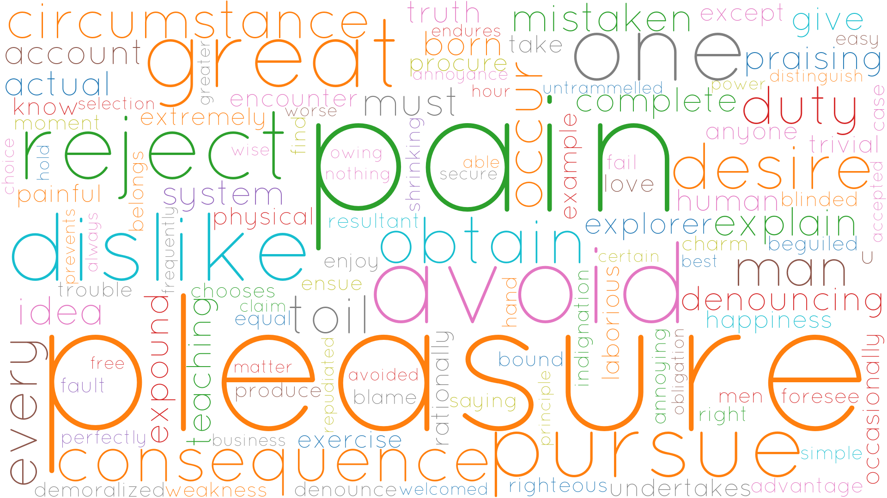
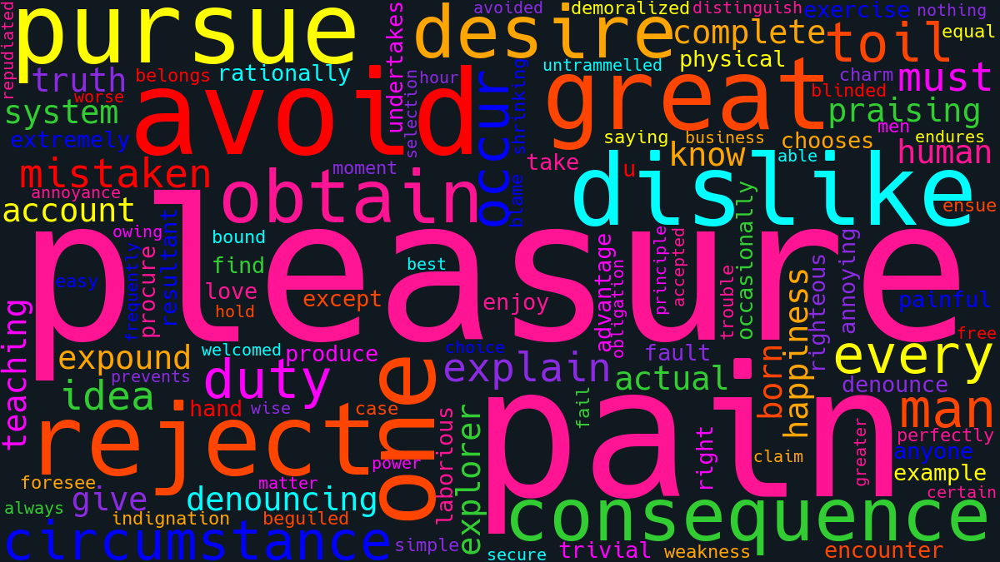
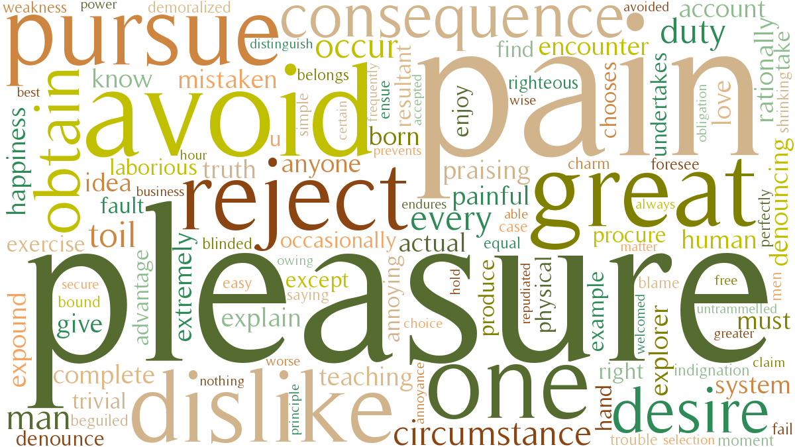
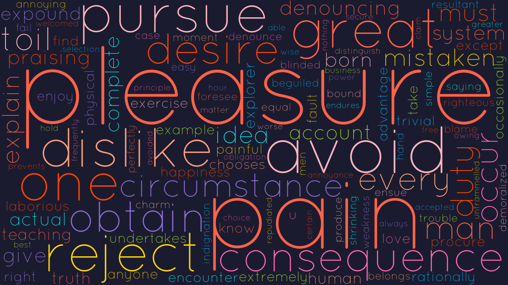

<div align="center">



# WordcloudGen

Make a word cloud out of a PDF, a Word document or a plain text file.
It comes as a desktop app for Windows and as a command-line tool that runs anywhere Python does.

[](https://github.com/biagio11/WordcloudGen/actions/workflows/ci.yml)
[](https://github.com/biagio11/WordcloudGen/releases/latest)
[](https://www.python.org/)
[](LICENSE)



</div>

## Download

On Windows you don't need Python. Open the [latest release](https://github.com/biagio11/WordcloudGen/releases/latest) and pick one of the two downloads:

- **`WordcloudGen-vX.Y.Z-windows-x64.exe`** is the whole app in one file. Double-click it and it runs; nothing gets installed.
- **`WordcloudGen-vX.Y.Z-windows-x64.zip`** is the same app as a folder. It starts a few seconds faster. Unzip it wherever you like and run `WordcloudGen.exe` inside.

The app isn't code-signed, so the first time you open it Windows SmartScreen may tell you it "protected your PC". Click **More info** and then **Run anyway**.

Images are saved to `Pictures\WordcloudGen` unless you choose another folder.

## Using the app

<div align="center">

</div>

1. Drop a document on the window, or press **Browse**. PDF, Word (`.docx`), `.txt` and `.md` files all work.
2. Choose a font, colors, background and size on the left.
3. Press **Generate**, or Ctrl+Enter.

Some things that aren't obvious at first:

- **The language is detected for you.** It decides which filler words ("the", "and", "di", "und") get removed. If a cloud comes out full of them, set the language by hand.
- **The most frequent words are listed under the preview.** Click one to leave it out, then generate again. This is the quickest way to get rid of words like "figure" or "chapter" that are everywhere and mean nothing.
- **Shape** fills an image instead of a rectangle. Words go in the dark parts, so a black silhouette on white works well, and so does a logo with a transparent background.
- **Keep this layout** reuses the last arrangement, so you can try other colors or backgrounds without the words moving around.
- You can drop fonts (`.ttf`, `.otf`), palettes (`.json`) and shape images on the window too. Each one goes to the right setting.
- Your settings are remembered between sessions.

Shortcuts: Ctrl+O opens a document, Ctrl+Enter or F5 generates, Ctrl+S saves a copy as PNG, JPEG or WebP.

## Running from source

You need Python 3.10 or newer.

```bash
git clone https://github.com/biagio11/WordcloudGen.git
cd WordcloudGen
python -m venv .venv
```

Activate the environment with `.venv\Scripts\activate` on Windows or `source .venv/bin/activate` on macOS and Linux, then:

```bash
pip install -r requirements.txt
python setup_nltk.py
python wordcloud_gen_GUI.py
```

`setup_nltk.py` downloads the word lists used to clean up the text. It only has to run once, and if you skip it the app downloads them the first time it needs them.

If you use conda, `conda env create -f environment.yml` followed by `conda activate wordcloud-env` replaces the first three steps.

## Command line

```bash
python wordcloud_gen.py input/demo.txt
```

This saves a PNG in `output/` and opens it in a window. A longer example:

```bash
python wordcloud_gen.py paper.pdf \
  --width 2560 --height 1440 \
  --background transparent \
  --font fonts/Quicksand_Light.otf \
  --color_file colors/vibrant_colors.json \
  --exclude-words figure table "et al" \
  --seed 42 --no-show
```

| Option | Default | What it does |
|---|---|---|
| `document` | | The PDF, `.docx` or text file to read. `--pdf` and `--txt` still work too. |
| `--lang` | detected | Language of the document, e.g. `english`, `italian`, `german`. |
| `--width`, `--height` | `1920`, `1080` | Image size in pixels, up to 8000 a side. |
| `--background` | `white` | A color name, a hex value, or `transparent`. |
| `--font` | built-in | A `.ttf` or `.otf` file. There are a dozen in [`fonts/`](fonts). |
| `--color_file` | built-in | A palette file. See [`colors/`](colors). |
| `--mask` | none | An image whose dark or opaque parts the words fill. |
| `--exclude-words` | none | Words to leave out. Put phrases in quotes: `"et al"`. |
| `--max-words` | `200` | How many words to draw. |
| `--collocations` | off | Allow two-word phrases like "new york". |
| `--seed` | random | Use the same number to get the same layout and colors again. |
| `--output` | | Write to this exact file (`.png`, `.jpg` or `.webp`). |
| `--output-dir` | `output` | Folder for the timestamped PNG. Created if it doesn't exist. |
| `--no-show` | off | Don't open a window, just save. Useful in scripts. |

`python wordcloud_gen.py --help` lists all of them, along with every supported language.

## Gallery

All four come from the same paragraph in [`input/demo.txt`](input/demo.txt). Only the font, palette and background change.

| | |
|:-:|:-:|
|  |  |
| Default palette on white | Vibrant palette on `#101820` |
|  |  |
| Earthy palette, Timeless font | Pastel palette, Quicksand font |

## Palettes

A palette is a small JSON file with a list of colors. Each word gets one of them at random.

```json
{
  "colors": ["#ebbf0d", "#2f9d00", "#cb6ce6", "#ff5757", "#008ada"]
}
```

A few come with the project in [`colors/`](colors). In the app you can build your own by clicking the swatches, then keep it with **Save...** next to the palette menu. Saved palettes show up in the menu from then on.

## Building the .exe yourself

```bash
pip install -r requirements-dev.txt
python build_exe.py
```

The script downloads the NLTK data and trims out what the app never uses, runs PyInstaller with [`wordcloud_gen_GUI.spec`](wordcloud_gen_GUI.spec), and then runs each build once with `--selftest` to be sure it can actually render a cloud. You end up with:

- `dist/WordcloudGen/`, the folder version
- `dist/WordcloudGen-portable.exe`, the single-file version
- `dist/release/`, both of them named for the release, plus a `SHA256SUMS.txt`

Antivirus software (not Defender, but others like Panda or Avast) sometimes blocks a freshly built unsigned `.exe`, which makes the self-test fail with "access denied" or hang. Allow the file in your antivirus, or build with `python build_exe.py --no-selftest` and try the app by hand.

If a build misbehaves, rebuild with a console attached so you can see the traceback:

```bash
WORDCLOUDGEN_CONSOLE=1 python build_exe.py
```

The packaged app also keeps a log at `%APPDATA%\WordcloudGen\wordcloudgen.log`.

### Publishing a release

Bump the version in `pyproject.toml` and `wordcloudgen/__init__.py`, add an entry to [`CHANGELOG.md`](CHANGELOG.md), then push a tag:

```bash
git tag v1.1.0
git push origin v1.1.0
```

GitHub Actions builds both versions on Windows, tests them on a machine with no Python data cached, and creates a draft release with the files attached. Look it over on the Releases page and press **Publish**.

## Development

```bash
pip install -r requirements-dev.txt
pytest
ruff check .
```

CI runs the tests on Windows and Linux with Python 3.10, 3.11 and 3.12. Both front ends are thin layers over [`wordcloudgen/core.py`](wordcloudgen/core.py), so a fix there reaches the app and the command line at once.

```
wordcloudgen/core.py      reading documents, cleaning text, rendering
wordcloudgen/settings.py  where the app keeps its settings
wordcloud_gen.py          command line
wordcloud_gen_GUI.py      desktop app
build_exe.py              builds the Windows app
tests/                    pytest suite
colors/  fonts/  input/   palettes, fonts and a sample document
```

## Troubleshooting

<details>
<summary><b>The cloud is full of words like "the" or "and"</b></summary>

The language guess was wrong, which can happen with very short texts. Choose the language yourself in the app, or pass `--lang`.

</details>

<details>
<summary><b>"has no selectable text"</b></summary>

The PDF is a scan: it holds pictures of pages rather than text. Run it through an OCR tool first (Acrobat, or the free `ocrmypdf`), then try again.

</details>

<details>
<summary><b>The transparent background looks white</b></summary>

The PNG does have transparency. Most image viewers just paint white behind it. Put it on a colored slide or open it in an image editor to check. JPEG has no transparency at all, so saving a transparent cloud as `.jpg` gives it a white background.

</details>

<details>
<summary><b><code>ModuleNotFoundError: No module named 'frontend'</code></b></summary>

The `fitz` package on PyPI is unrelated to PyMuPDF and gets in its way. Remove it and reinstall PyMuPDF:

```bash
pip uninstall -y fitz pymupdf
pip install --upgrade --force-reinstall pymupdf
```

</details>

<details>
<summary><b><code>LookupError: Resource punkt not found</code></b></summary>

The NLTK data never downloaded. Run `python setup_nltk.py`. It also works behind proxies that use their own certificates.

</details>

<details>
<summary><b>The app crashed</b></summary>

Sorry about that. The details are in `%APPDATA%\WordcloudGen\wordcloudgen.log`. Please [open an issue](https://github.com/biagio11/WordcloudGen/issues) and attach that file.

</details>

## Contributing

Bug reports, ideas and pull requests are all welcome. For anything big, open an [issue](https://github.com/biagio11/WordcloudGen/issues) first so we can talk it over. [CONTRIBUTING.md](CONTRIBUTING.md) has the practical details.

## License

WordcloudGen by [biagio11](https://github.com/biagio11) is licensed under [CC BY-NC-SA 4.0](https://creativecommons.org/licenses/by-nc-sa/4.0/). You can share and adapt it for non-commercial use, with credit, under the same license.

The fonts in [`fonts/`](fonts) belong to their authors and keep their own licenses.
